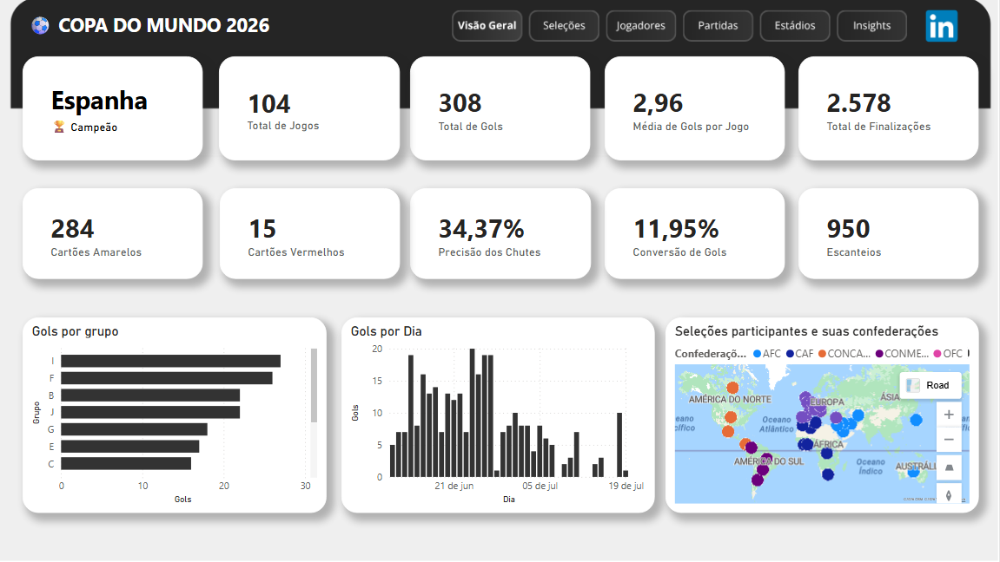

# ⚽ Dashboard Copa do Mundo 2026 — Dados do futebol transformados em insights com Power BI

<p align="left">
  
  
  
  
  
</p>

Projeto de análise de dados desenvolvido no **Power BI** para explorar os principais acontecimentos da Copa do Mundo de 2026. O dashboard reúne indicadores, rankings, comparações e insights sobre partidas, seleções, jogadores, estádios, gols, assistências, cartões e desempenho esportivo.

O projeto foi criado para portfólio e aplica conceitos de coleta e organização de dados, modelagem dimensional, Power Query, DAX, visualização de dados e experiência do usuário.

🔗 **Acesse o Dashboard:**  
👉 [Dashboard Copa do Mundo 2026](https://sites.google.com/view/dashboardcopadomundo2026/)

---

<p align="center">
  
</p>

---

## Sumário

- [Visão geral](#visão-geral)
- [Objetivos do projeto](#objetivos-do-projeto)
- [Fonte e preparação dos dados](#fonte-e-preparação-dos-dados)
- [Modelagem de dados](#modelagem-de-dados)
- [Principais medidas DAX](#principais-medidas-dax)
- [Páginas do dashboard](#páginas-do-dashboard)
- [Conclusões da análise](#conclusões-da-análise)
- [Destaques técnicos](#destaques-técnicos)
- [Tecnologias utilizadas](#tecnologias-utilizadas)
- [Como executar](#como-executar)
- [Estrutura do repositório](#estrutura-do-repositório)
- [Limitações dos dados](#limitações-dos-dados)
- [Próximas melhorias](#próximas-melhorias)
- [Aviso](#aviso)
- [Autor](#autor)

---

## Visão geral

A Copa do Mundo gera uma grande quantidade de dados sobre equipes, partidas, jogadores e estádios. Quando esses registros são analisados separadamente, torna-se mais difícil identificar padrões, comparar desempenhos e transformar números em conclusões úteis.

Este projeto organiza essas informações em um dashboard interativo capaz de responder perguntas como:

- Qual seleção marcou mais gols?
- Quais equipes conquistaram mais vitórias?
- Qual seleção apresentou o melhor aproveitamento?
- Quem foi o artilheiro e quem liderou em assistências?
- Quais partidas tiveram maior volume ofensivo?
- Quais estádios receberam mais jogos e gols?
- Existe relação entre finalizações e gols marcados?
- Qual equipe apresentou maior eficiência ofensiva?
- Qual seleção teve o melhor equilíbrio entre ataque e defesa?

---

## Objetivos do projeto

- Estruturar dados esportivos em um modelo dimensional.
- Consolidar o desempenho das seleções como mandantes e visitantes.
- Criar medidas DAX reutilizáveis e responsivas aos filtros.
- Desenvolver rankings, indicadores e cartões com textos dinâmicos.
- Comparar o desempenho de seleções, jogadores, partidas e estádios.
- Transformar métricas em insights claros e visualmente acessíveis.
- Construir uma experiência de navegação consistente entre as páginas.

---

## Fonte e preparação dos dados

Os dados foram organizados a partir dos **relatórios oficiais das partidas — Full Time Match Report da FIFA**. Entre as informações utilizadas estão:

- resultados e placares;
- gols e assistências;
- cartões amarelos e vermelhos;
- posse de bola;
- finalizações e chutes no alvo;
- escanteios;
- seleções e jogadores;
- estádios;
- grupos, rodadas e fases da competição.

Os registros foram reunidos manualmente em uma planilha do **Microsoft Excel**, tratados no **Power Query** e carregados no Power BI para modelagem e análise.

---

## Modelagem de dados

O modelo foi estruturado com tabelas de **dimensão** e **fato**, mantendo os dados descritivos separados dos registros de eventos e resultados.

| Tabela                | Tipo / função                                                                                                                                           |
|-----------------------|---------------------------------------------------------------------------------------------------------------------------------------------------------|
| `DimSelecao`          | **Dimensão.** Armazena nome da seleção, continente, confederação, ranking FIFA e quantidade de títulos. Também relaciona os jogadores às suas seleções. |
| `DimSelecaoCasa`      | **Dimensão de papel.** Representa a seleção mandante e mantém ativo o relacionamento com `FatoPartidas[id_selecao_casa]`.                               |
| `DimSelecaoFora`      | **Dimensão de papel.** Representa a seleção visitante e mantém ativo o relacionamento com `FatoPartidas[id_selecao_fora]`.                              |
| `DimJogador`          | **Dimensão.** Contém o identificador, o nome e a seleção dos jogadores presentes nos registros de eventos.                                              |
| `DimEstadio`          | **Dimensão.** Reúne nome oficial, nome utilizado na competição, cidade, país e capacidade dos estádios.                                                 |
| `FatoPartidas`        | **Tabela fato.** Registra cada partida, incluindo data, fase, grupo, estádio, seleções, placar e estatísticas coletivas.                                |
| `FatoPartidasJogador` | **Tabela fato.** Registra eventos individuais por partida, como gols, assistências, cartões e gols contra.                                              |

### Modelo dimensional

<p align="center">
  
</p>

### Decisão de modelagem

As tabelas `DimSelecaoCasa` e `DimSelecaoFora` foram criadas porque uma seleção pode assumir dois papéis em uma partida: mandante ou visitante. Essa abordagem, conhecida como **role-playing dimension**, permite manter os dois relacionamentos ativos e evita caminhos ambíguos no modelo.

---

## Principais medidas DAX

As medidas DAX foram desenvolvidas para produzir indicadores confiáveis e dinâmicos em diferentes contextos de filtro.

### Indicadores gerais

- total de jogos;
- total e média de gols;
- total de finalizações;
- chutes no alvo e precisão;
- conversão de finalizações em gols;
- escanteios;
- cartões amarelos e vermelhos.

### Indicadores por seleção

- jogos, vitórias, empates e derrotas;
- gols marcados e sofridos;
- saldo de gols;
- pontos e aproveitamento;
- média de gols;
- posse média;
- finalizações e chutes no alvo;
- eficiência ofensiva;
- cartões.

### Indicadores de jogadores e estádios

- artilheiro;
- líder de assistências;
- participações em gols;
- cartões por jogador;
- estádio com mais jogos;
- estádio com mais gols;
- média de gols por estádio;
- maior capacidade.

### Funções DAX utilizadas

- agregação: `SUM`, `COUNTROWS`, `DISTINCTCOUNT`;
- proporções e médias: `DIVIDE`, `AVERAGEX`;
- contexto de filtro: `CALCULATE`, `FILTER`, `VALUES`, `ALL`, `ALLSELECTED`;
- relacionamento virtual: `TREATAS`;
- tabelas virtuais: `ADDCOLUMNS`, `SELECTCOLUMNS`;
- rankings e extremos: `TOPN`, `MAXX`, `MINX`;
- tratamento de valores vazios: `COALESCE`, `ISBLANK`;
- textos dinâmicos: `FORMAT`, `CONCATENATEX`;
- organização dos cálculos: `VAR` e `RETURN`.

### Exemplos de medidas

A seguir estão algumas das medidas desenvolvidas no projeto que demonstram o uso de tabelas virtuais, contexto de filtro, rankings e geração dinâmica de textos.

#### Seleção com mais vitórias

A medida consolida as vitórias de cada seleção como mandante e visitante, identifica o maior número de vitórias e trata possíveis empates na liderança.

```DAX
Equipe com Mais Vitórias - Cartão =
VAR TabelaEquipes =
    ADDCOLUMNS(
        SELECTCOLUMNS(
            ALL(DimSelecao),
            "IdEquipe", DimSelecao[id_selecao],
            "NomeEquipe", DimSelecao[selecao]
        ),
        "TotalVitorias",
        VAR IdAtual = [IdEquipe]

        VAR VitoriasCasa =
            CALCULATE(
                COUNTROWS(FatoPartidas),
                FatoPartidas[id_selecao_casa] = IdAtual,
                FatoPartidas[gols_casa] > FatoPartidas[gols_fora]
            )

        VAR VitoriasFora =
            CALCULATE(
                COUNTROWS(FatoPartidas),
                FatoPartidas[id_selecao_fora] = IdAtual,
                FatoPartidas[gols_fora] > FatoPartidas[gols_casa]
            )

        RETURN
            VitoriasCasa + VitoriasFora
    )

VAR MaiorNumeroVitorias =
    MAXX(
        TabelaEquipes,
        [TotalVitorias]
    )

VAR EquipesEmpatadas =
    FILTER(
        TabelaEquipes,
        [TotalVitorias] = MaiorNumeroVitorias
    )

VAR NomesEquipes =
    CONCATENATEX(
        EquipesEmpatadas,
        [NomeEquipe],
        " e ",
        [NomeEquipe],
        ASC
    )

RETURN
    NomesEquipes
        & " (" & FORMAT(MaiorNumeroVitorias, "0") & IF( MaiorNumeroVitorias = 1, " vitória", " vitórias" ) & ")"
```

#### Estádio com mais gols

A medida cria uma tabela virtual com os estádios, calcula o total de gols associado a cada um e utiliza `TOPN` para identificar o estádio com o maior valor.

```DAX
Estádio com Mais Gols =
VAR TabelaEstadios =
    ADDCOLUMNS(
        ALL(
            DimEstadio[id_estadio],
            DimEstadio[estadio_fifa]
        ),
        "GolsMarcados", [Total de Gols]
    )

VAR TopEstadio =
    TOPN(
        1,
        TabelaEstadios,
        [GolsMarcados], DESC,
        DimEstadio[estadio_fifa], ASC
    )

RETURN
    CONCATENATEX( TopEstadio, DimEstadio[estadio_fifa] & " (" & FORMAT([GolsMarcados], "0") & " gols)", "" )
```

#### Artilheiro

A medida agrupa os jogadores, calcula o total de gols de cada um e retorna dinamicamente o jogador — ou os jogadores, em caso de empate — com mais gols na competição.

```DAX
Artilheiro =
VAR TabelaJogadores =
    SUMMARIZE(
        DimJogador,
        DimJogador[jogador],
        "TotalGols", SUM(FatoPartidasJogador[gols])
    )

VAR TopJogador =
    TOPN(
        1,
        TabelaJogadores,
        [TotalGols], DESC
    )

RETURN
    CONCATENATEX( TopJogador, DimJogador[jogador] & UNICHAR(10) & " (" & [TotalGols] & " gols)", ", " )
```

Algumas medidas de destaque também tratam **empates na liderança**, exibindo todas as seleções ou jogadores que compartilham o maior valor.

---

## Páginas do dashboard

### 1️⃣ Visão Geral

Resumo executivo da competição, com:

- campeão;
- total de jogos e gols;
- média de gols por partida;
- finalizações, chutes no alvo e precisão;
- conversão ofensiva;
- escanteios e cartões;
- gols por grupo;
- evolução dos gols por dia;
- distribuição por confederação;
- mapa das seleções participantes.

### 2️⃣ Seleções

Comparação do desempenho coletivo:

- seleções com mais gols e vitórias;
- melhor saldo de gols;
- melhor aproveitamento;
- rankings por gols e aproveitamento;
- tabela com jogos, vitórias, empates, derrotas, gols, saldo, pontos e aproveitamento.

### 3️⃣ Jogadores

Análise dos destaques individuais:

- artilheiro;
- líder de assistências;
- maior participação em gols;
- gols, assistências, cartões e gols contra por jogador.

### 4️⃣ Partidas

Análise detalhada jogo a jogo:

- placar;
- posse de bola;
- finalizações;
- chutes no alvo;
- escanteios;
- cartões;
- eventos individuais dos jogadores;
- filtros por partida, fase, grupo, estádio e seleções.

### 5️⃣ Estádios

Comparação dos locais da competição:

- estádio com mais jogos;
- estádio com mais gols;
- maior capacidade;
- média de gols por estádio;
- jogos, gols e capacidade por estádio;
- tabela com cidade, país e indicadores de utilização.

### 6️⃣ Insights

Página dedicada à análise de relações entre desempenho ofensivo, defensivo e eficiência das seleções, utilizando cartões analíticos e gráficos de dispersão.

---

## Conclusões da análise

A análise dos dados permitiu identificar alguns destaques e padrões relevantes da competição:

- **Os Países Baixos** apresentaram a melhor eficiência ofensiva da competição, convertendo **23,9% das finalizações em gols**.
- **Espanha** teve a melhor defesa, sofrendo em média apenas **0,13 gol por partida**.
- **Alemanha** registrou a vitória mais dominante do torneio, com **7 a 1 sobre Curaçao**.
- **Espanha** apresentou o melhor equilíbrio entre ataque e defesa, com **saldo médio de 1,63 gol por partida**.
- A análise entre **finalizações e gols marcados** indica uma tendência positiva, embora maior volume ofensivo não garanta necessariamente maior eficiência.

---

## Destaques técnicos

- Construção de modelo dimensional com tabelas fato e dimensão.
- Uso de dimensões de papel para seleções mandantes e visitantes.
- Consolidação das estatísticas das equipes nos dois contextos da partida.
- Medidas DAX sensíveis a filtros de seleção, fase, grupo, partida e estádio.
- Rankings com filtro Top N.
- Tratamento de empates em medidas de liderança.
- Cartões com frases dinâmicas.
- Tratamento de valores nulos com `COALESCE`.
- Comparações por meio de gráficos de dispersão.
- Navegação entre páginas e segmentações interativas.
- Padronização visual e preocupação com hierarquia de informação.

---

## Tecnologias utilizadas

| Tecnologia           | Aplicação no projeto                                           |
|----------------------|----------------------------------------------------------------|
| **Power BI Desktop** | Modelagem, criação dos visuais e desenvolvimento do dashboard. |
| **Power Query**      | Limpeza, transformação e preparação dos dados.                 |
| **DAX**              | Criação de medidas, rankings, indicadores e textos dinâmicos.  |
| **Microsoft Excel**  | Organização inicial e armazenamento da base de dados.          |
| **Canva**            | Criação autoral dos backgrounds e assets visuais do dashboard  |
| **Google Sites**     | Publicação e apresentação online do dashboard.                 |
| **Git**              | Versionamento do projeto.                                      |
| **GitHub**           | Documentação e publicação do portfólio.                        |

---

## Como executar

1. Clone ou baixe este repositório.
2. Abra o arquivo `.pbix` no **Power BI Desktop**.
3. Caso necessário, altere o caminho da planilha em **Transformar dados → Configurações da fonte de dados**.
4. Clique em **Atualizar** para recarregar os dados.
5. Navegue pelas páginas e utilize os filtros para explorar o relatório.

> É necessário ter o Power BI Desktop instalado para abrir o arquivo `.pbix`.

---

## Estrutura do repositório

```text
copa-do-mundo-2026-power-bi/
│
├── assets/
│   ├── Preview.png
│   ├── Modelo Dimensional.png
│   ├── Visão Geral.png
│   ├── Seleções.png
│   ├── Jogadores.png
│   ├── Partidas.png
│   ├── Estádios.png
│   └── Insights.png
│
├── dashboard-copa-do-mundo.pbix
│
├── CopaMundo2026_DadosPowerBI.xlsx
│
└── README.md
```
---

## Limitações dos dados

- A coleta foi realizada manualmente a partir dos relatórios oficiais das partidas.
- A tabela `FatoPartidasJogador` contém apenas jogadores com algum evento registrado, como gol, assistência, cartão ou gol contra.
- Por esse motivo, o projeto não analisa participação completa do elenco, minutos jogados ou jogadores sem eventos.
- Resultados e insights dependem da integridade e atualização da planilha utilizada como fonte.

---

## Próximas melhorias

- Automatizar parte da coleta de dados por meio de APIs.
- Criar uma versão mobile do dashboard.
- Adicionar novos indicadores estatísticos.
- Explorar atualização automatizada dos dados.

---

## Aviso

Este é um projeto acadêmico e independente, desenvolvido para fins de estudo e portfólio.

O projeto não possui vínculo, patrocínio ou associação oficial com a FIFA ou com os organizadores da competição.

---

## Autor

Desenvolvido por **Jorge Gabriel Modrow**.

Estudante de Tecnologia em Análise e Desenvolvimento de Sistemas na **Universidade Federal do Paraná — UFPR**.

- LinkedIn: [Ver perfil](https://www.linkedin.com/in/jorgemodrow/)
- GitHub: [Ver perfil](https://github.com/jorgemodrow)
